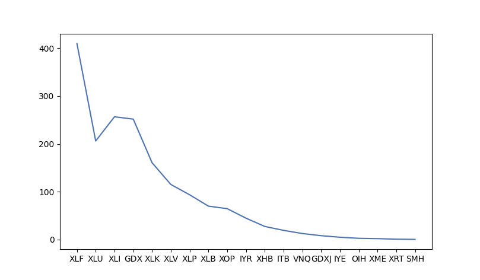

# Portfolio Optimization
## Description
This project is a program that will take a length of assets, and find the best portfolio allocation for a certain number of assests in the portfolio. The portfolio optimization is from the tutorial in this article https://randerson112358.medium.com/python-for-finance-portfolio-optimization-66882498847.  

I'm also a complete beginner when it comes to finance and python, but I find it very interesting so all feedback is great! 

### Goals
The goal of this project was to build off the tutorial above by making the code run through numerous variations and speed it up. I timed the script for the first run through and it took around 34 minutes to complete. Now, I wanted to learn how to speed code up, which I will explain below. The full code source will show each step and explain the lines of code. 
 
### Setup

    ##############################################################
    # LIST OF SECTOR ETFS FROM https://www.cnbc.com/sector-etfs/ #
    ##############################################################
    
    etfs = ['XLE', 'XLF', 'XLU', 'XLI', 'GDX', 'XLK', 'XLV', 'XLP', 'XLB', 'XOP', 'IYR', 'XHB', 'ITB','VNQ','GDXJ','IYE','OIH', 'XME','XRT', 'SMH', 'IBB' , 'KBE', 'KRE', 'XTL']

#### Let's see how many combinations
To get an idea of how many portfolios/items our script needs to go through, I will look at Combinations and Permutations. Combinations and Permutations are ways we can count how many different subsets of a particular number of objects there are. In this case we with choose Combinations because order doesn't matter for us. A combination of [1,2,3] is the same as [2,1,3] or [3,2,1].

    def  get_combinations(n):
	    comb = itertools.combinations(etfs,r=n)
	    comb_list = [i for i in comb]
	    return comb_list
    length = get_combinations(5)
    print(len(length))
    
    Output:
    42504
This means there are 42,504 possible portfolios consisting of 5 assests. n is how many assests will be in the portfolio.

### First run through

    Output:
    
    ######### BEST PORTFOLIO #########
    ['GDX' 'XOP' 'VNQ' 'OIH' 'SMH']
    OrderedDict([('GDX', 0.0), ('XOP', 0.0), ('VNQ', 0.0), ('OIH', 0.0), ('SMH', 1.00001)])
    Expected annual return: 27.66 %
    Annual volatility: 27.66 %
    Sharpe Ratio: 27.66
    Discrete Allocation:  {'SMH': 4}
    Funds remaing: $165.56
    Execution Time for Script: 2067.18 sec
On the first run through the combinations are stored in a list called comb_list. To speed this up I changed it to a numpy array.

    comb = itertools.combinations(etfs,r=n)
    comb_nparr = np.array([i for i in comb])
This ultimately sped the script up slightly by around 4 minutes giving a 30 minute run time. Still very very very long.
### Next steps
I noticed that starting at the beginning of the ETF's list each new starting asset would decrease in time. For example, from the list above "XLE" is the first one, so the script runs thorugh all combinations starting with "XLE". This takes the longest, and then next is "XLF" which takes a shorter amount time of because the totalnumber objects in the etfs list is minus 1 every new iteration. 

I stored the times it took to start a new iteration and graphed it. 
See below:

    run_times = ['XLE took 0.13492369651794434 ',
    'XLF took 410.19258737564087 sec to start',
    'XLU took 616.2740490436554 sec to start',
    'XLI took 872.9125480651855 sec to start',
    'GDX took 1124.6930992603302 sec to start',
    'XLK took 1285.2598481178284 sec to start',
    'XLV took 1400.3425860404968 sec to start',
    'XLP took 1493.922125339508 sec to start',
    'XLB took 1563.764530658722 sec to start',
    'XOP took 1628.3061652183533 sec to start',
    'IYR took 1672.984756231308 sec to start',
    'XHB took 1700.365168094635 sec to start',
    'ITB took 1719.5674049854279 sec to start',
    'VNQ took 1732.1381072998047 sec to start',
    'GDXJ took 1740.282814025879 sec to start',
    'IYE took 1744.993224143982 sec to start',
    'OIH took 1747.5899469852448 sec to start',
    'XME took 1749.4680421352386 sec to start',
    'XRT took 1750.1885492801666 sec to start',
    'SMH took 1750.4778926372528 sec to start']
    
    times = pd.Series([0.13492, 410.192, 616.274, 872.912, 1124.69, 1285.25, 1400.34, 1493.92, 1563.76, 1628.30, 1672.98, 1700.36, 1719.56, 1732.13, 1740.2, 1744.99, 1747.58, 1749.46, 1750.18, 1750.47])
    print(type(times)) # checking type -- gives <class 'pandas.core.series.Series'>
    change = times.diff()
    print(change)
    plt.plot(['XLE', 'XLF','XLU','XLI','GDX','XLK','XLV','XLP','XLB','XOP','IYR','XHB','ITB','VNQ','GDXJ','IYE','OIH','XME', 'XRT', 'SMH'], change)
    plt.show()

I found taht I should split my process at the start of "XLI" because that was roughly half the total script time.

    def  two_processes(etfs, n):
	    comb = itertools.combinations(etfs,r=n) 
	    comb_nparr = np.array([i for i in comb])
	    for i in  range(0,len(comb_nparr)):
		    if comb_nparr[i][0] == 'XLI':
			    first_process = comb_nparr[0:i]
			    second_process = comb_nparr[i:]
			    return [first_process, second_process]
    
    first_process = two_processes(etfs,5)[0]
    second_process = two_processes(etfs,5)[1]  
    print(first_process)
    print(second_process)
    
    Output:
     [['XLE' 'XLF' 'XLU' 'XLI' 'GDX']
     ['XLE' 'XLF' 'XLU' 'XLI' 'XLK']
     ['XLE' 'XLF' 'XLU' 'XLI' 'XLV']
     ...
     ['XLU' 'SMH' 'IBB' 'KRE' 'XTL']
     ['XLU' 'SMH' 'KBE' 'KRE' 'XTL']
     ['XLU' 'IBB' 'KBE' 'KRE' 'XTL']]
    [['XLI' 'GDX' 'XLK' 'XLV' 'XLP']
     ['XLI' 'GDX' 'XLK' 'XLV' 'XLB']
     ['XLI' 'GDX' 'XLK' 'XLV' 'XOP']
     ...
     ['XRT' 'SMH' 'KBE' 'KRE' 'XTL']
     ['XRT' 'IBB' 'KBE' 'KRE' 'XTL']
     ['SMH' 'IBB' 'KBE' 'KRE' 'XTL']]

##### Run Time with 2 Processes

    ######### BEST PORTFOLIO multiprocessing #########
    
    ['XLF' 'IYR' 'XHB' 'ITB' 'SMH']
    OrderedDict([('XLF', 0.0), ('IYR', 0.0), ('XHB', 0.0), ('ITB', 0.0), ('SMH', 1.0)])
    Expected annual return: 27.66 %
    Annual volatility: 27.66 %
    Sharpe Ratio: 27.66
    Discrete Allocation:  {'SMH': 4}
    Funds remaing: $165.56
    Execution Time for Script: 1087.11 sec
About 18 minutes!

## Conclusion

The purpose was to establish a way of thinking to improve the speed of my script.

### Other Steps to take
Another step would be the shrink the number of assets to loop through, which would decrease the time as well. To do that, I could only run the operation on assets with a positive return to eliminate assets that didn't perform well. 

Again, feedback is great!
